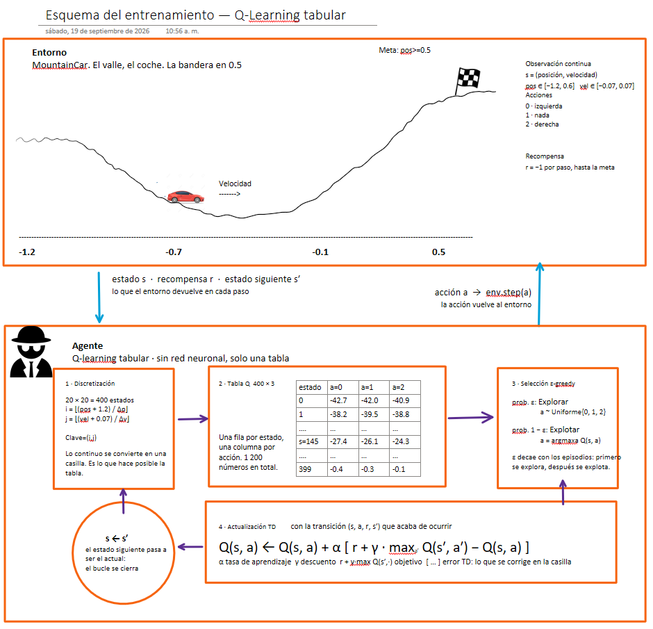
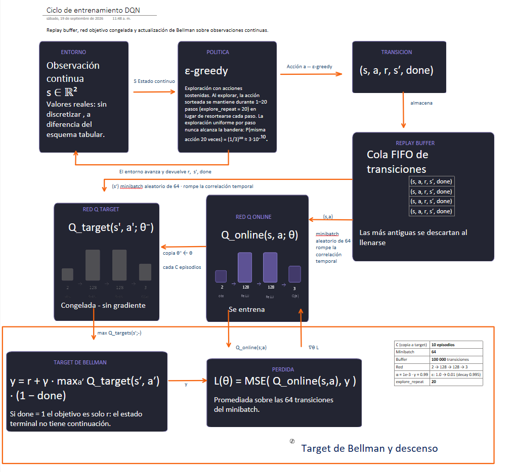

# Q-Learning tabular vs. DQN en MountainCar-v0

**William Mauricio Torres**
Maestría en Inteligencia Artificial — Universidad de La Sabana
*Simulación y Aprendizaje por Refuerzo* · Unidad 03

Implementación y comparación de dos enfoques de aprendizaje por refuerzo sobre el entorno
[MountainCar-v0](https://gymnasium.farama.org/environments/classic_control/mountain_car/):
un agente **Q-Learning tabular** con discretización del espacio de estados, y un agente
**Deep Q-Network (DQN)** con aproximación por red neuronal.

Repositorio base: [emiliomunozai/mountain_car](https://github.com/emiliomunozai/mountain_car) —
la infraestructura (CLI, bucles de entrenamiento, persistencia) venía escrita; los algoritmos
estaban como stubs `EXERCISE` por completar.

---

## Resultados

Ambos agentes evaluados con **política puramente greedy sobre 100 episodios** con semillas
fijas (1234–1333), de modo que enfrentan exactamente los mismos estados iniciales.

| | Q-Learning tabular | DQN |
|---|---:|---:|
| **Recompensa media** | **−113,18** | **−106,43** |
| Mejor episodio | −88 | **−86** |
| Peor episodio | −180 | **−114** |
| Desviación estándar | 22,04 | **8,15** |
| Llega a la bandera | **100/100** | **100/100** |
| ¿Supera el umbral de −110? | No (por 3 puntos) | **Sí** |
| Episodios de entrenamiento | 20 000 | **2 500** |
| Tiempo de entrenamiento | **148 s** | 1 258 s |
| Parámetros aprendidos | **900** | 17 283 |

> En MountainCar la recompensa es −1 por paso, así que **el retorno es el negativo de la
> duración del episodio: menos negativo es mejor**. El suelo es −200 (nunca llega a la
> bandera) y el umbral convencional de "resuelto" es −110.

**La comparación completa está en [RESULTADOS.md](RESULTADOS.md)**, con el análisis de
estabilidad, velocidad de aprendizaje, ventajas, limitaciones y dificultad de implementación.

---

## Esquemas del proceso de entrenamiento

<!-- ============================================================
     TODO: reemplazar por tus dibujos propios.
     Guarda las imágenes como docs/esquema_qlearning.png y
     docs/esquema_dqn.png y descomenta las líneas de abajo.
     ============================================================ -->

### Q-Learning tabular



*(pendiente: esquema propio del ciclo estado → acción → recompensa → actualización)*

### DQN



*(pendiente: esquema propio con replay buffer, red target y actualización de Bellman)*

---

## Evidencia de los mejores resultados

### Curvas de aprendizaje


**Comentario.** Las dos curvas cuentan historias distintas. El **tabular** (izquierda) arranca
pegado al suelo de −200 durante ~2 500 episodios —mientras la exploración aleatoria no
encuentra la bandera, no hay nada que aprender— y a partir de ahí sube de forma ruidosa pero
**monótona en tendencia**: nunca desaprende, porque cada actualización toca una sola celda de
la tabla. El **DQN** (derecha) aprende mucho más rápido en número de episodios, alcanza su
mejor media móvil de **−114,8 en el episodio 1 318**, y después **oscila entre −115 y −160 sin
converger**. Esa inestabilidad es característica del RL profundo: cada paso de gradiente
modifica todos los pesos y por tanto los valores Q de todos los estados a la vez, así que
mejorar una región puede degradar otra.

### Distribución en los 100 episodios de evaluación


**Comentario.** Aquí se ve por qué el DQN gana. No es solo que su media sea 6,75 puntos mejor:
es que su distribución es **estrecha** (σ = 8,15) mientras la del tabular es **bimodal**
(σ = 22,04), con una cola de episodios entre −160 y −180 que arrastra el promedio. Esa cola
viene de la discretización: la rejilla de 20×20 agrupa estados físicamente distintos en la
misma celda, y desde ciertos estados iniciales la política toma una decisión subóptima que
cuesta 50–70 pasos extra. El peor episodio del DQN (−114) es mejor que la media del tabular.

### Políticas aprendidas


**Comentario.** Esta figura es la evidencia más directa de la diferencia entre ambos métodos.
La política del tabular está **escalonada** y llena de celdas aisladas incoherentes con sus
vecinas —un píxel rojo en plena región azul— porque cada celda se aprende por separado y
algunas se visitaron muy pocas veces (300 de 400 celdas visitadas). La del DQN tiene
**fronteras suaves y continuas**: la red generaliza entre estados cercanos, así que un estado
poco visitado hereda el conocimiento de sus vecinos.

Ambas, sin embargo, descubrieron la misma estrategia física: **empujar en la dirección del
movimiento** para bombear energía al sistema. Se nota en que el color cambia principalmente
con el signo de la velocidad (eje vertical), no con la posición.

### Salida de la evaluación

Los números exactos están en [`results/resumen.json`](results/resumen.json) y el log completo
del entrenamiento en [`results/entrenamiento.txt`](results/entrenamiento.txt).

```
$ uv run mountaincar load qlearning --eval
Q-Learning agent for MountainCar-v0
  Episodes trained : 20000
  States visited   : 300 / 400
  Epsilon          : 0.0100
  LR / Gamma       : 0.1 / 0.99

Evaluating (10 episodes) ...
  Mean reward: -111.00 +/- 21.46
  Reached the flag: 10/10 episodes

$ uv run mountaincar load dqn --eval
DQN agent for MountainCar-v0
  Episodes trained  : 2500
  Network params    : 17,283
  Epsilon           : 0.0100
  LR / Gamma        : 0.001 / 0.99
  Batch size        : 64
  Target update     : every 10 episodes
  Explore repeat    : up to 20 steps per exploratory action
  Device            : cpu

Evaluating (10 episodes) ...
  Mean reward: -108.20 +/- 7.64
  Reached the flag: 10/10 episodes
```

---

## El proceso seguido

### Paso 2 — Q-Learning tabular

La observación de MountainCar son 2 números continuos y una tabla Q necesita claves discretas,
así que cada dimensión se parte en 20 bins y cada celda de la rejilla 20×20 resultante se trata
como un estado. Tres piezas:

| Función | Qué hace |
|---|---|
| `discretize` | `np.digitize` sobre los bordes de bin → tupla `(i, j)` hashable |
| `select_action` | ε-greedy, con `deterministic=True` cortocircuitando **antes** del sorteo |
| `_update` | `Q(s,a) += lr · [r + γ·max Q(s',a') − Q(s,a)]` |

**Decisión que importa:** `terminated` y `truncated` no son lo mismo. Solo `terminated` (llegó
a la bandera) corta el bootstrapping; una truncación por el límite de 200 pasos **no** es un
estado terminal del MDP y hay que seguir haciendo bootstrapping a través de ella. Tratarlas
igual le enseña al agente que el mundo se acaba en el paso 200.

Hiperparámetros: `n_bins=20`, `lr=0.1`, `gamma=0.99`, ε de 1,0 → 0,01 con decaimiento 0,9995
por episodio. Entrenamiento: 20 000 episodios.

### Paso 3 — DQN

La tabla se reemplaza por una red `2 → 128 → 128 → 3` (17 283 parámetros), lo que elimina la
discretización pero añade dos máquinas: un **replay buffer** y una **red target**.

**Detalle de implementación:** la salida de la red no lleva activación. En MountainCar todos
los valores Q son negativos, así que un ReLU los clamparía a ≥ 0 y el objetivo sería
inalcanzable. Y el paso de aprendizaje lleva un `assert` explícito de formas, porque un
broadcast silencioso entre `(64,1)` y `(64,)` no lanza error: simplemente entrena sobre basura.

### El problema que costó más: la exploración

Con el algoritmo correctamente implementado, **el DQN reportaba −200,00 exactos,
indefinidamente**. Ni inestable ni lento: plano, en el peor valor posible.

La investigación está en [`scripts/diagnostico_ex3.py`](scripts/diagnostico_ex3.py) y se
reproduce ejecutándolo. Medí en lugar de suponer:

| `explore_repeat` | Éxitos / 300 episodios | Posición máxima media |
|---:|---:|---:|
| 1 (ε-greedy de libro) | **0** | −0,387 |
| 10 | 1 | −0,195 |
| 20 | 24 | −0,057 |
| 40 | 41 | +0,005 |

Cero de 300. La bandera está en 0,5 y el coche ni se acerca: **el agente nunca observó el
evento que supuestamente debe aprender a causar**. Y midiendo los valores Q de una red
entrenada así:

```
Q medio: -18,18   |   separación entre acciones: 0,0053
```

La separación entre las tres acciones dentro de un mismo estado es **cero**. La red afirma que
da igual lo que se haga, y el Q medio avanza hacia −100, que es exactamente el punto fijo
teórico: si nunca se alcanza la meta, todo estado vale −1/(1−γ) = −100.

**La lectura correcta:** la red aprendió bien. Aprendió que nada de lo que hace importa, lo
cual —dados los datos que vio— es cierto. El fallo está aguas arriba, en cómo se recolectan
los datos.

Escapar del valle exige un tramo sostenido de unos 20 empujones en la misma dirección (el
bombeo de un niño en un columpio). La exploración uniforme sortea una acción nueva **en cada
paso**, de modo que las acciones consecutivas son independientes:

    P(misma acción 20 veces seguidas) = (1/3)²⁰ ≈ 2,87 × 10⁻¹⁰

No es mala suerte: el comportamiento necesario le resulta **inalcanzable**. Añadir episodios no
lo arregla nunca.

**La corrección** fue darle a la exploración la propiedad que le faltaba: correlación temporal.
Cuando el agente decide explorar, se compromete con la acción sorteada durante un tramo
aleatorio de 1 a 20 pasos en vez de resortear cada paso. No se tocó la recompensa, ni el
entorno, ni la regla de aprendizaje: solo la recolección de datos.

---

## Cómo ejecutarlo

### Instalación

El proyecto usa [uv](https://docs.astral.sh/uv/). Requiere Python 3.11.

```bash
git clone https://github.com/witorres08/Unisabana_EFMIA-SAPR20265.git
cd Unisabana_EFMIA-SAPR20265
uv sync
```

### Reproducir el experimento completo

```bash
uv run python scripts/experimento.py      # entrena y evalúa ambos agentes (~23 min en CPU)
uv run python scripts/graficas.py         # genera las cuatro figuras de results/
uv run python scripts/diagnostico_ex3.py  # reproduce la evidencia del problema de exploración (~3 min)
```

### Usar los agentes ya entrenados

Los modelos entrenados están versionados en `saves/`, así que se pueden usar sin reentrenar:

```bash
uv run mountaincar list                       # qué agentes hay y si tienen save
uv run mountaincar inspect                    # espacios de estado/acción del entorno
uv run mountaincar load qlearning --eval      # evaluar el tabular
uv run mountaincar load dqn --eval            # evaluar el DQN
uv run mountaincar render dqn --episodes 3    # ver el agente manejando (ventana gráfica)
uv run mountaincar sim qlearning --steps 10   # ver los primeros pasos como texto
```

### Reentrenar desde cero

```bash
uv run mountaincar delete qlearning
uv run mountaincar train qlearning --episodes 20000
uv run mountaincar train dqn --episodes 2500
```

> **Nota:** `train` reanuda desde el save existente si lo hay. Para empezar limpio hay que
> borrar el save primero.

---

## Estructura del proyecto

```
src/mountain_car/
├── cli.py                    # CLI (del repo base)
└── agents/
    ├── qlearning.py          # Q-Learning tabular  <- implementado
    └── dqn.py                # QNetwork, ReplayBuffer, DQNAgent  <- implementado
scripts/
├── experimento.py            # entrena, evalúa y escribe results/
├── graficas.py               # genera las figuras
└── diagnostico_ex3.py        # evidencia del problema de exploración
results/                      # figuras, historiales (.npy), resumen.json y log
saves/                        # modelos entrenados de ambos agentes
docs/                         # esquemas del proceso de entrenamiento
RESULTADOS.md                 # comparación completa (Paso 4)
EXERCISES.md                  # enunciado de los ejercicios (del repo base)
```

---

## El entorno MountainCar-v0

Un coche con motor insuficiente está en un valle. No puede subir la colina derecha de frente,
así que tiene que mecerse hacia atrás y adelante para acumular impulso. La meta es la bandera
en la posición `0.5`.

**Estado** — 2 valores continuos:

| Índice | Variable | Rango |
|:---:|---|---|
| 0 | Posición del coche | −1,2 a 0,6 |
| 1 | Velocidad del coche | −0,07 a 0,07 |

**Acciones** — 3 discretas: `0` acelerar a la izquierda, `1` no acelerar, `2` acelerar a la
derecha.

**Recompensa** — `−1` por cada paso dado; el episodio termina al llegar a la bandera o se
trunca a los 200 pasos.

Esa recompensa plana es lo que hace interesante al problema: **no hay gradiente que seguir
hacia la meta**, así que el agente tiene que tropezarse con la bandera por exploración antes de
poder aprender nada.

---

## Referencias

- Sutton, R. S., & Barto, A. G. (2018). *Reinforcement Learning: An Introduction* (2.ª ed.). MIT Press.
- Mnih, V., et al. (2013). *Playing Atari with Deep Reinforcement Learning*. arXiv:1312.5602.
- Mnih, V., et al. (2015). Human-level control through deep reinforcement learning. *Nature, 518*, 529–533.
- Documentación de [Gymnasium — MountainCar-v0](https://gymnasium.farama.org/environments/classic_control/mountain_car/).
- Repositorio base del curso: [emiliomunozai/mountain_car](https://github.com/emiliomunozai/mountain_car).
