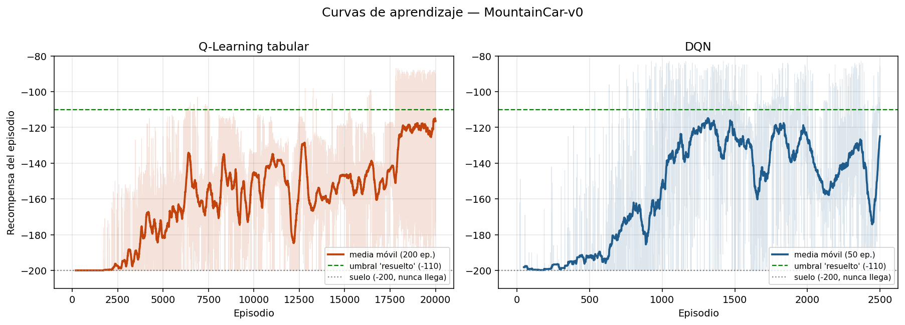
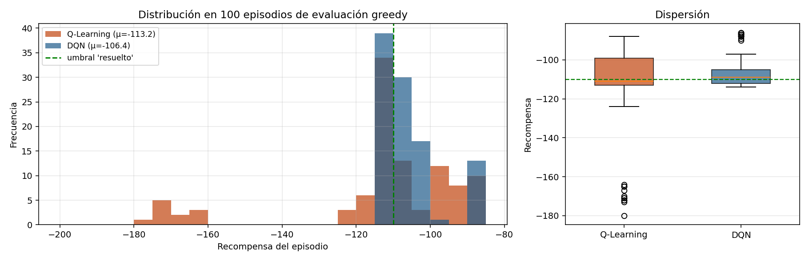
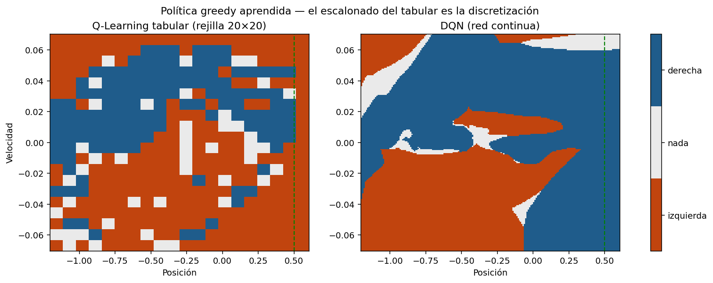

# Q-Learning tabular vs. DQN en MountainCar-v0

**William Mauricio Torres** · Maestría en Inteligencia Artificial, Universidad de La Sabana
Simulación y Aprendizaje por Refuerzo — Unidad 03

Este documento corresponde al **Paso 4** de la actividad. Todos los números salen de
`results/resumen.json` y se reproducen con:

```bash
uv run python scripts/experimento.py    # entrena y evalúa ambos agentes
uv run python scripts/graficas.py       # genera las figuras
uv run python scripts/diagnostico_ex3.py  # la evidencia del Ejercicio 3
```

---

## 1. Resultados

Ambos agentes se evaluaron con **política puramente greedy sobre 100 episodios** con semillas
fijas (1234-1333), de modo que enfrentan exactamente los mismos estados iniciales.

| | Q-Learning tabular | DQN |
|---|---:|---:|
| **Recompensa media** | **−113,18** | **−106,43** |
| Desviación estándar | 22,04 | **8,15** |
| Mejor episodio | −88 | **−86** |
| Peor episodio | −180 | **−114** |
| Llega a la bandera | 100/100 | 100/100 |
| ¿Supera el umbral de −110? | No (por 3 puntos) | **Sí** |
| Episodios de entrenamiento | 20 000 | **2 500** |
| Tiempo de entrenamiento | **148 s** | 1 258 s |
| Parámetros aprendidos | **900** (300 estados × 3) | 17 283 |
| Cobertura del espacio | 300 de 400 celdas | continua |





---

## 2. Comparación punto por punto

### 2.1 Estabilidad del entrenamiento

Ninguno de los dos es estable, pero fallan de maneras distintas.

El **tabular** tiene una curva ruidosa pero **monótona en tendencia**: nunca desaprende lo que ya
sabía. Cada actualización toca una sola celda de la tabla, así que aprender sobre un estado no
puede estropear lo aprendido sobre otro. El ruido de su curva viene de la exploración, no del
método.

El **DQN** muestra el patrón opuesto y característico del aprendizaje por refuerzo profundo: su
media móvil alcanza el mejor valor, **−114,8, en el episodio 1 318**, y a partir de ahí **oscila
entre −115 y −160 sin converger**. El log de entrenamiento cierra en −140,95 (media de los
últimos 250 episodios), *peor* que mil episodios antes. La causa
es que cada paso de gradiente modifica todos los pesos de la red y por tanto los valores Q de
**todos** los estados a la vez: mejorar una región del espacio puede degradar otra. Es el
fenómeno que la literatura llama *catastrophic forgetting*, y por eso en RL profundo se guarda
el mejor checkpoint en vez de confiar en el último.

> **Veredicto:** el tabular es más estable durante el entrenamiento; el DQN es más estable en el
> resultado final (desviación estándar de 8,15 frente a 22,04 en evaluación). No es
> contradictorio: son dos cosas distintas.

### 2.2 Velocidad de aprendizaje

Depende de la unidad con que se mida, y es la comparación donde más fácil se engaña uno.

| Unidad | Q-Learning | DQN | Gana |
|---|---:|---:|---|
| Episodios hasta que la media móvil supera −150 | 6 279 | 1 005 | **DQN (6,2×)** |
| Tiempo de reloj hasta ese mismo punto | 46 s | 506 s | **Tabular (11×)** |
| Coste por episodio | 7,4 ms | 503 ms | **Tabular (68×)** |
| Episodios totales para el resultado final | 20 000 | 2 500 | **DQN (8×)** |

El DQN es **mucho más eficiente en muestras** —necesita entre seis y ocho veces menos
interacción con el entorno— pero **mucho más costoso por muestra**, porque cada paso ejecuta un
forward y un backward sobre un lote de 64 transiciones. En MountainCar el entorno es gratis, así que el
tabular gana en tiempo de reloj. En un problema donde cada muestra cuesta dinero o tiempo real
(un robot físico, una campaña comercial), la conclusión se invierte por completo: ahí la
eficiencia en muestras es lo único que importa.

### 2.3 Desempeño final

El DQN gana por **6,75 puntos de media** y, sobre todo, por consistencia: su peor episodio de
cien es −114, mientras que el tabular tiene una cola de episodios entre −160 y −180 que arrastra
su promedio. El histograma lo muestra con claridad — la distribución del DQN es estrecha y la
del tabular tiene dos modos.

De dónde sale esa cola: la rejilla de 20×20 agrupa estados físicamente distintos en la misma
celda, y desde ciertos estados iniciales la política discretizada toma una decisión subóptima
que cuesta 50-70 pasos extra. **El gráfico de políticas es la evidencia directa**: la del
tabular está llena de celdas aisladas incoherentes con sus vecinas —un píxel rojo en plena
región azul—, porque cada celda se aprende por separado y algunas se visitaron muy pocas veces.
La del DQN tiene fronteras suaves y continuas: la red **generaliza** entre estados cercanos, así
que un estado poco visitado hereda el conocimiento de sus vecinos.

Ambas políticas, sin embargo, descubrieron la misma estrategia física: empujar en la dirección
del movimiento para bombear energía al sistema. Se ve en que el color cambia principalmente con
el signo de la velocidad (eje vertical), no con la posición.

### 2.4 Ventajas y limitaciones

**Q-Learning tabular**

| Ventajas | Limitaciones |
|---|---|
| Convergencia garantizada por teoría, bajo condiciones conocidas | Requiere discretizar: `n_bins` es un hiperparámetro crítico y arbitrario |
| Sin hiperparámetros frágiles: solo `lr`, `gamma` y el esquema de epsilon | **Maldición de la dimensionalidad**: con 2 dimensiones son 400 celdas; con 10 serían 20^10 ≈ 10^13 |
| Cada valor es inspeccionable y depurable a mano | No generaliza: una celda no visitada no sabe nada, por muy parecidos que sean sus vecinos |
| 900 parámetros, 148 s de entrenamiento | Solo aplica a observaciones de baja dimensión y con cotas conocidas |
| Estable: una actualización no puede dañar otro estado | Su desempeño está limitado por la resolución de la rejilla |

**DQN**

| Ventajas | Limitaciones |
|---|---|
| No requiere discretizar: opera sobre la observación continua | Muchos más hiperparámetros, y varios son frágiles |
| **Generaliza** entre estados similares, de ahí la política suave | Sin garantías de convergencia; puede desaprender |
| Escala a espacios de estados de alta dimensión (píxeles, sensores) | 8,5× más lento en tiempo de reloj para este problema |
| 8× más eficiente en muestras | Casi imposible de depurar por inspección directa |
| Mejor desempeño final y menos varianza en evaluación | **Requiere resolver el problema de exploración** (sección 3) |

### 2.5 Dificultad de implementación

El contraste aquí es más grande que en cualquier métrica de desempeño.

El **tabular** son tres funciones de 2-4 líneas cada una: discretizar, elegir acción greedy y
aplicar la actualización TD. Funcionó al primer intento. El único punto de cuidado es tratar
`terminated` y `truncated` de forma distinta.

El **DQN** tiene tres capas de dificultad:

1. **Mecánica** (Ejercicio 2): construir la red y el paso de aprendizaje. Directo si se cuidan
   las formas de los tensores — un *broadcast* silencioso entre `(64, 1)` y `(64,)` no lanza
   error, simplemente entrena sobre basura. Por eso el código incluye un `assert` explícito.
2. **Conceptual**: entender por qué hacen falta dos redes y por qué el target no debe llevar
   gradiente. Sin target network el objetivo se mueve con cada actualización.
3. **Diagnóstica** (Ejercicio 3): descubrir que el algoritmo correcto **no aprende nada** en
   este entorno, y que la causa no está en el algoritmo. Esto costó más que los otros dos juntos
   y es el contenido de la sección siguiente.

> **Veredicto:** implementar el tabular es un ejercicio de programación; implementar el DQN es un
> ejercicio de depuración experimental. La diferencia no es la cantidad de código —son
> aproximadamente 40 líneas contra 15— sino la cantidad de formas silenciosas en que puede
> fallar.

---

## 3. El Ejercicio 3: por qué el DQN correcto no aprendía

Con los ejercicios 1 y 2 terminados, el DQN reportaba **−200,00 exactos, indefinidamente**. Ni
inestable ni lento: plano, en el peor valor posible. El script `scripts/diagnostico_ex3.py`
reproduce la investigación.

### La evidencia

**Medición 1 — ¿cuántos episodios aleatorios llegan a la bandera?** No razonar, contar:

| `explore_repeat` | Éxitos / 300 episodios | Posición máxima media |
|---:|---:|---:|
| 1 (epsilon-greedy de libro) | **0** | −0,387 |
| 5 | 0 | −0,273 |
| 10 | 1 | −0,195 |
| 20 | 24 | −0,057 |
| 40 | 41 | +0,005 |

Cero de 300. No "pocas veces": **nunca**. La bandera está en 0,5 y el coche ni siquiera se acerca.
El agente jamás observó el evento que supuestamente debe aprender a causar.

**Medición 2 — ¿qué aprendió la red con esos datos?** Entrenando 200 episodios con exploración
de libro y midiendo los Q-values sobre 200 estados aleatorios:

```
Q medio: -18,18   |   separación entre acciones: 0,0053
```

La separación entre las tres acciones dentro de un mismo estado es **prácticamente cero**: la red
afirma que da exactamente igual lo que se haga. Y el Q medio avanza hacia −100, que es
justamente el punto fijo teórico: si nunca se alcanza la meta, todo estado vale la suma
descontada de −1 para siempre, es decir −1/(1−γ) = **−100** con γ = 0,99.

### La lectura

**La red aprendió correctamente.** Aprendió que nada de lo que hace importa — lo cual, dados los
datos que vio, es verdad. El fallo no está en el aprendizaje sino **aguas arriba, en cómo se
recolectan los datos**.

Escapar del valle exige un tramo sostenido de unos 20 empujones en la misma dirección — el
movimiento de bombeo de un niño en un columpio. La exploración uniforme sortea una acción nueva
de entre tres en **cada paso**, de modo que las acciones consecutivas son estadísticamente
**independientes**:

    P(misma acción 20 veces seguidas) = (1/3)^20 ≈ 2,87 × 10⁻¹⁰

Empujones independientes de media cero se cancelan y producen una caminata aleatoria que deja el
coche oscilando en el fondo del valle. **No es mala suerte: el comportamiento necesario es
inalcanzable para esa política.** Añadir episodios no lo arregla nunca.

### La corrección

Darle a la exploración la propiedad que le falta: **correlación temporal**. Cuando el agente
decide explorar, se compromete con la acción sorteada durante un tramo aleatorio de 1 a
`explore_repeat` pasos en lugar de volver a sortear en cada paso.

```python
if self._sticky_left > 0:          # dentro de un tramo comprometido
    self._sticky_left -= 1
    return self._sticky_action
if random.random() < self.epsilon:  # empieza un tramo nuevo
    self._sticky_action = random.randrange(self.action_dim)
    self._sticky_left = random.randint(1, self.explore_repeat) - 1
    return self._sticky_action
```

Con `explore_repeat = 20` la tasa de éxito aleatorio pasa de 0/300 a **24/300**, y eso es todo lo
que el código de aprendizaje necesitaba. Nótese que **no se tocó la recompensa, ni el entorno, ni
la regla de aprendizaje**: solo la recolección de datos. Y `deterministic=True` sigue siendo
greedy puro, así que las cifras de evaluación siguen siendo honestas.

### Por qué el log de entrenamiento se ve peor que la evaluación

El entrenamiento termina reportando −141 mientras la evaluación greedy da −106. No es una
contradicción, es una consecuencia directa del arreglo.

Durante el entrenamiento, con ε = 0,01 y episodios de unos 150 pasos, la probabilidad de que un
episodio contenga **al menos un** evento exploratorio es 1 − 0,99¹⁵⁰ ≈ **78 %**. Y cada evento ya
no cuesta un paso: secuestra hasta 20 pasos consecutivos en una dirección fija, lo que
típicamente arruina el ritmo del bombeo y alarga el episodio. En evaluación no hay exploración,
así que se ve la política real.

Es el precio del arreglo, y es el correcto de pagar: sin él no habría política que evaluar.

---

## 4. Conclusiones

1. **Ambos métodos resuelven el problema** — 100/100 episodios llegan a la bandera. Solo el DQN
   cruza el umbral convencional de −110.
2. **La ventaja del DQN no está donde uno esperaría.** No es que sea "más potente": es que
   generaliza entre estados vecinos, lo que se ve directamente en la suavidad de su política y
   en la desviación estándar de 8,15 frente a 22,04.
3. **Para este problema, el tabular es la elección razonable.** Dos dimensiones acotadas, un
   simulador gratuito y 148 segundos de entrenamiento frente a 21 minutos. El DQN se justifica
   cuando el espacio de estados no admite discretización, no cuando simplemente está disponible.
4. **El componente más difícil del DQN no fue el DQN.** Fue descubrir que un algoritmo
   correctamente implementado puede no aprender nada por razones que no están en el algoritmo.
   Un agente que reporta una métrica plana no necesariamente tiene un bug: puede estar
   aprendiendo perfectamente algo verdadero e inútil.
5. **Advertencia metodológica:** todo lo anterior es de **una sola semilla por agente**. El
   ruido entre semillas en RL es considerable y ninguna diferencia menor a unos pocos puntos
   debería tomarse como concluyente sin repetir con 5-10 semillas e intervalos de confianza.

---

## 5. Reproducibilidad

```bash
uv sync
uv run python scripts/experimento.py      # ~23 min en CPU
uv run python scripts/graficas.py
uv run python scripts/diagnostico_ex3.py  # ~3 min

# o con el CLI del repo
uv run mountaincar train qlearning --episodes 20000
uv run mountaincar load qlearning --eval
uv run mountaincar render dqn --episodes 3
```

Entorno usado: Python 3.11, PyTorch 2.14 (CPU), Gymnasium 1.3, `MountainCar-v0` sin modificar.
Las semillas de evaluación son fijas; las de entrenamiento no, así que una re-ejecución dará
números cercanos pero no idénticos.
